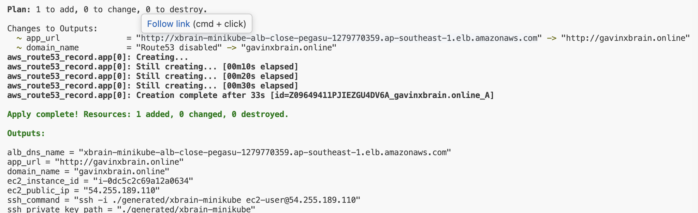
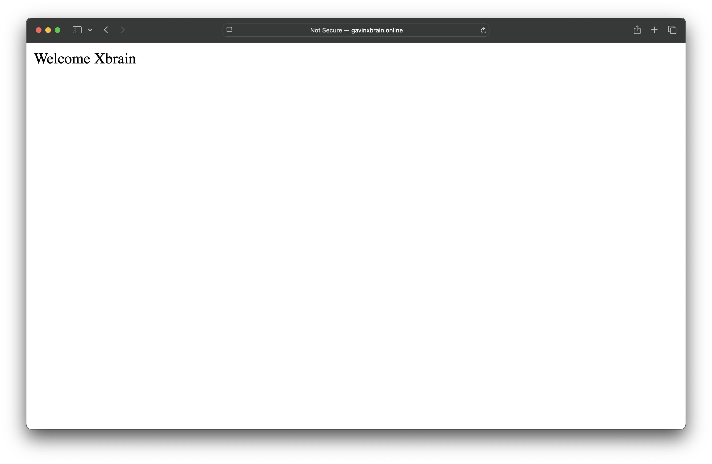

# Xbrain Minikube AWS

Terraform 1-click demo: tao EC2, chay minikube ben trong, deploy nginx `Welcome Xbrain` trong Kubernetes va expose ra Internet qua ALB.

## Chay

Yeu cau: Terraform `>= 1.5`, AWS credentials.

```bash
make up
```

Lay URL:

```bash
terraform output app_url
```

Mac dinh `app_url` la ALB DNS name, nen khong can co domain rieng. Vi du:

```text
http://<alb-dns-name>.ap-southeast-1.elb.amazonaws.com
```

ALB co the mat vai phut de healthy vi EC2 can cai Docker, minikube va pull image.

SSH key duoc Terraform tao tu dong tai:

```text
generated/xbrain-minikube
```

SSH vao EC2:

```bash
$(terraform output -raw ssh_command)
```

## Kien truc

```text
Internet
  -> Route53 A alias (optional)
  -> Public ALB :80
  -> EC2 :30080
  -> socat forward
  -> minikube NodePort :30080
  -> Kubernetes Service
  -> nginx Deployment replicas=3
```

## Thiet ke

- EC2 dung minikube Docker driver de giu bai demo gon va dung yeu cau app nam trong Kubernetes.
- Terraform tu tao SSH key pair va gan vao EC2 de co the test/debug K8s ngay sau khi apply.
- ALB forward vao EC2 port `30080`; Kubernetes Service dung `NodePort` cung port nay.
- `socat` chi bridge traffic tu EC2 host vao IP cua minikube node.
- Route53 la optional; neu khong cau hinh domain thi dung truc tiep ALB DNS.

## Provider wire

Repo dung >=2 provider:

- `aws`: VPC, subnet, EC2, security group, ALB, target group, listener, optional Route53.
- `cloudinit`: render bootstrap script va Kubernetes manifest vao `aws_instance.user_data_base64`.
- `random`: tao suffix tranh trung ten resource.
- `tls`: tao SSH key pair.
- `local`: ghi private key vao `generated/xbrain-minikube`.

Wire chinh: `data.cloudinit_config.minikube_bootstrap.rendered` duoc truyen vao `aws_instance.minikube_host.user_data_base64`, nen Terraform tao ha tang AWS va bootstrap minikube/app trong cung mot lan apply.

## Tuy bien

Gioi han SSH theo public IP cua ban:

```bash
terraform apply -auto-approve \
  -var='aws_region=ap-southeast-1' \
  -var='instance_type=t3.micro' \
  -var='allowed_ssh_cidr=x.x.x.x/32'
```

Neu co domain va public hosted zone Route53, apply them bien domain:

```bash
terraform apply -auto-approve \
  -var='route53_zone_name=your-domain.com' \
  -var='domain_name=your-domain.com' \
  -var='allowed_ssh_cidr=x.x.x.x/32'
```

Sau do `terraform output app_url` se tra ve:

```text
http://your-domain.com
```

## Don dep

```bash
make destroy
```

## Evidence

### Terraform init


### Terraform plan


### Terraform apply


### ALB URL


### Terraform apply Route53



### Route53 URL


