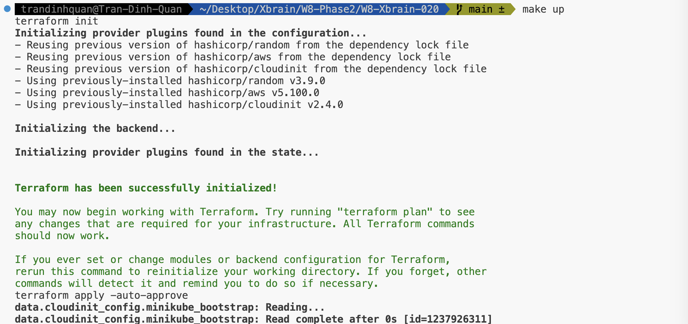
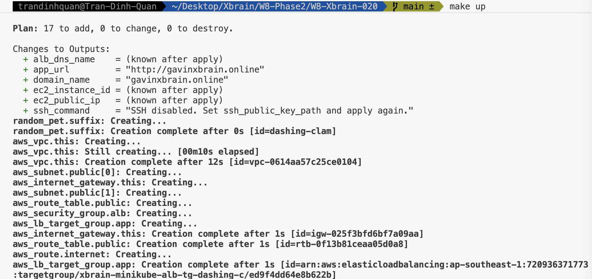
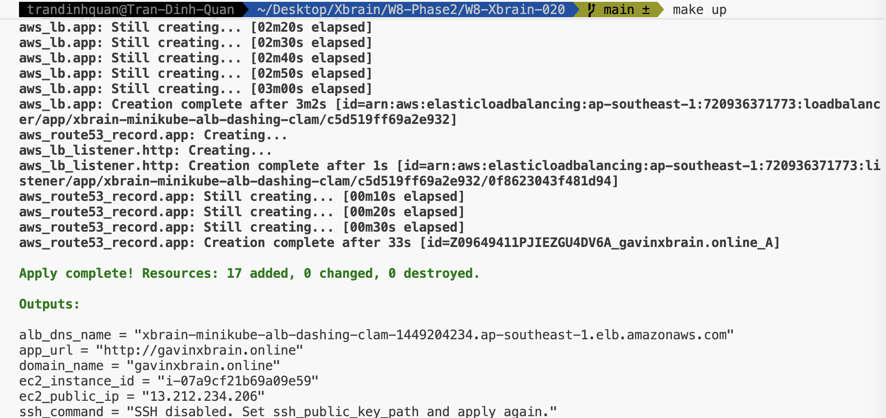
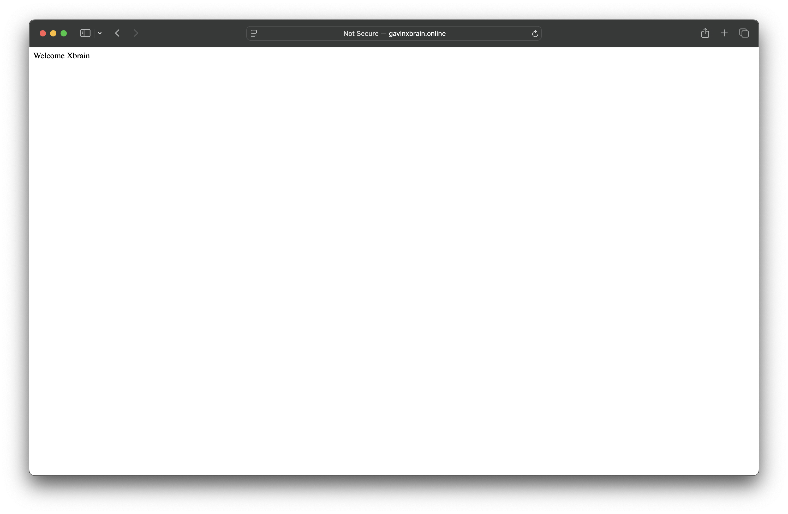

# Xbrain Minikube AWS

Terraform 1-click demo: tao EC2, chay minikube ben trong, deploy nginx `Welcome Xbrain` trong Kubernetes va expose ra Internet qua ALB.

## Chay

Yeu cau: Terraform `>= 1.5`, AWS credentials, Route53 hosted zone `gavinxbrain.online`.

```bash
make up
```

Lay URL:

```bash
terraform output app_url
```

Mac dinh:

```text
http://gavinxbrain.online
```

ALB co the mat vai phut de healthy vi EC2 can cai Docker, minikube va pull image.

## Kien truc

```text
Internet
  -> Route53 A alias
  -> Public ALB :80
  -> EC2 :30080
  -> socat forward
  -> minikube NodePort :30080
  -> Kubernetes Service
  -> nginx Deployment replicas=3
```

## Thiet ke

- EC2 dung minikube Docker driver de giu bai demo gon va dung yeu cau app nam trong Kubernetes.
- ALB forward vao EC2 port `30080`; Kubernetes Service dung `NodePort` cung port nay.
- `socat` chi bridge traffic tu EC2 host vao IP cua minikube node.
- Route53 tao domain public tro ve ALB.

## Provider wire

Repo dung >=2 provider:

- `aws`: VPC, subnet, EC2, security group, ALB, target group, listener, Route53.
- `cloudinit`: render bootstrap script va Kubernetes manifest vao `aws_instance.user_data_base64`.
- `random`: tao suffix tranh trung ten resource.

Wire chinh: `data.cloudinit_config.minikube_bootstrap.rendered` duoc truyen vao `aws_instance.minikube_host.user_data_base64`, nen Terraform tao ha tang AWS va bootstrap minikube/app trong cung mot lan apply.

## Tuy bien

```bash
terraform apply -auto-approve \
  -var='aws_region=ap-southeast-1' \
  -var='instance_type=t3.micro' \
  -var='domain_name=gavinxbrain.online'
```

## Don dep

```bash
make destroy
```

## Evidence

Anh/video bang chung luu trong folder `evidence/`.

Can co 4 anh:

- `evidence/terraform-init-success.png`: ket qua `terraform init` thanh cong.
- `evidence/terraform-plan-success.png`: ket qua `terraform plan` thanh cong.
- `evidence/terraform-apply-success.png`: ket qua `terraform apply` thanh cong va hien outputs.
- `evidence/alb-url-success.png`: trinh duyet mo `http://gavinxbrain.online` va hien `Welcome Xbrain`.

### Terraform init



### Terraform plan



### Terraform apply



### ALB URL


